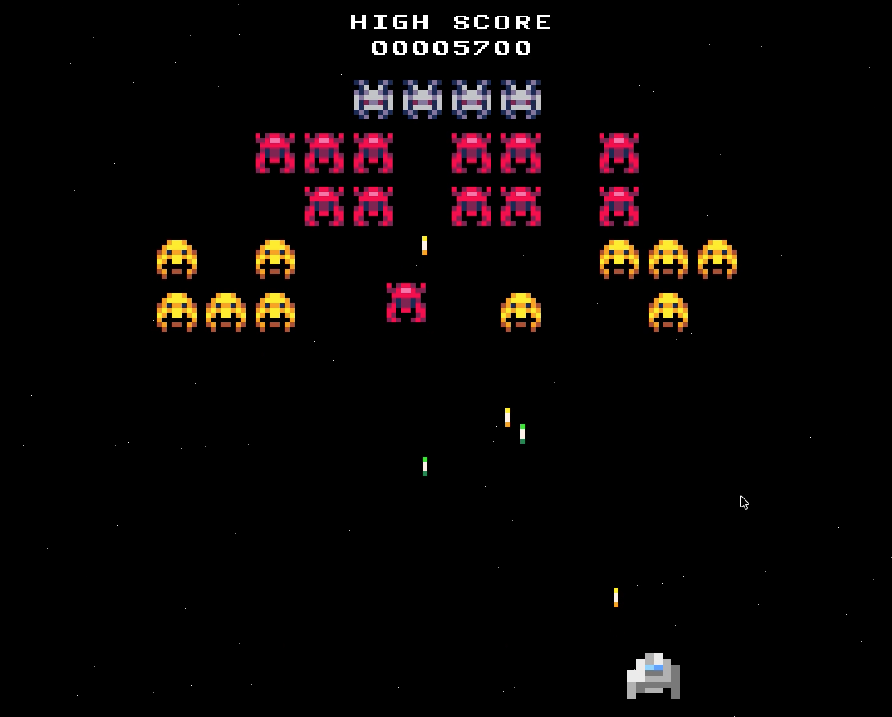
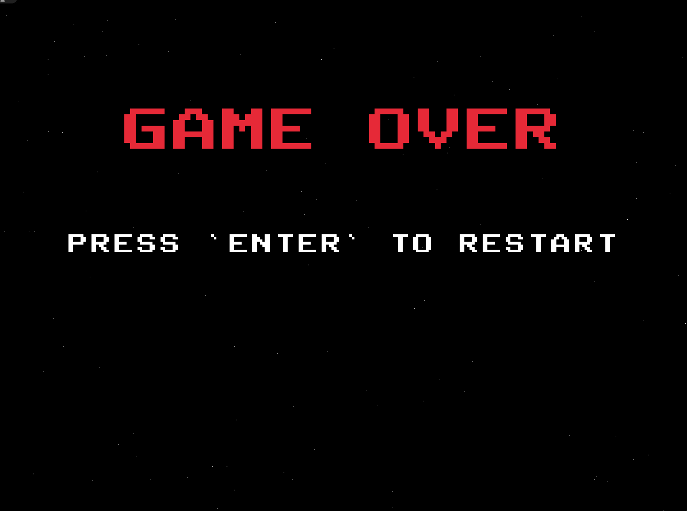

# Space_Shooter

A small but structured **C++ arcade-style space shooter** built with **raylib** and **CMake**.
The project uses Raylib version 5.5, which is installed by its CMake config. 

## Game

  
    

**Controls:** 
- W | ← : Move left
- D | → : Move right
- SPACE : Shoot

# Requirements:

- C++ compiler (Clang, GCC, or MSVC)
- CMake ≥ 3.15
- Git
- Raylib 5.5

# Clone the Project:

`git clone https://github.com/hirchmi19/Space_Shooter.git`  
`cd Space_Shooter`

# Build & Run:

`mkdir build` 
`cd build` 
`cmake -B build`  
`cmake --build build`

### Run the exe (example):

`./cmake-build-debug/Space_Shooter`

# Credits

### Libraries
- raylib – https://www.raylib.com/

### Assets

- Public Pixel Font – CC0 (Public Domain)  
  https://ggbot.itch.io/public-pixel-font

- “Space Eaters” sprites by cluly – Used under the license provided on itch.io
  https://cluly.itch.io/space-eaters

- Player sprite by Gustavo Vituri – Used under the license provided on itch.io
  https://gvituri.itch.io/space-shooter

